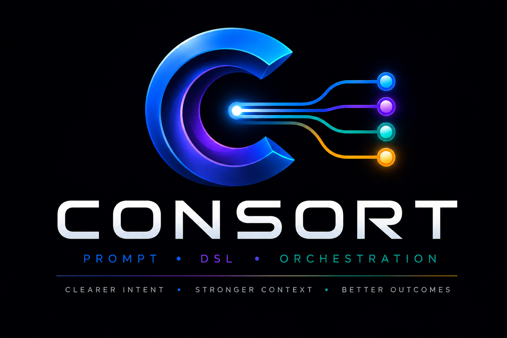

# CONSORT - Markdown for Intelligent Coordination
Consort Markdown for Intelligent Coordination Super Prompt 

(previously known as Consort Structured English for AI Super Prompt DSL)

Copyright © 2026 Michael Herman (Bindloss, Alberta, Canada) – Creative Commons Attribution-ShareAlike 4.0 International Public License


> Consort coordinates the processes by which intelligent participants understand, decide, act, learn, and adapt - across an unlimited range of business, engineering, scientific, and medical domains.

## Consort is Markdown for Intelligent Coordination

Consort is a minimal, symbol-based structured prompt
language designed for clarity, density, and reduced ambiguity — distinct
voices, each with a distinct role, combining into one coherent prompt. It is
used both for human-authored prompts and for structured messages passed
between AI agents (for example, a parent agent delegating a task to a
sub-agent), where a single string typically carries the entire briefing with
no other shared context.

Consort coordinates intelligent participants toward a desired outcome under constraints and uncertainty, using evidence and feedback. The range of specialties includes:
- medical care
- meal/menu design
- trip planning
- competitive analysis
- software quality
- engineering
- procurement
- research
- incident response
- business strategy
- scientific investigation
- personal decision making

Same coordination substrate. Different participants, knowledge, capabilities, evidence, decisions and actions.

## Use Cases

Consort coordinates problem solving as an evidence-driven, closed-loop process of understanding, deciding, acting, evaluating, and adapting.

See [docs/TAXONOMY.md](docs/TAXONOMY.md) for this same loop worked out across all twelve domains listed above, including the eight not broken out below.

### Medical Care

Observe → Assess → Investigate → Diagnose → Plan → Treat → Monitor → Reassess → Adapt

### Menu Planning

Understand occasion → Assess constraints → Investigate options → Design menu → Select → Prepare → Serve → Evaluate → Adapt

### Competitive Analysis

Frame strategic question → Understand market → Investigate competitors → Analyze → Decide → Act → Monitor → Reassess → Adapt

### Software Quality

Define quality objectives → Understand system → Inspect/test → Diagnose defects → Prioritize → Remediate → Test → Evaluate → Adapt

### Summary

| General function | Medical | Dinner menu | Competitive analysis | Software quality |
|---|---|---|---|---|
| **Frame** | Patient problem | Occasion & guests | Strategic question | Quality objective |
| **Understand** | History/symptoms | Preferences/constraints | Market situation | Architecture/codebase |
| **Investigate** | Tests/examination | Ingredients/options | Competitor research | Testing/inspection |
| **Decide** | Diagnosis/treatment plan | Menu selection | Strategy | Remediation priorities |
| **Act** | Treat | Cook/serve | Execute strategy | Fix/refactor/deploy |
| **Evaluate** | Clinical response | Guest response | Market response | Test/quality results |
| **Adapt** | Change treatment | Adjust menu | Revise strategy | Correct/retest |
| **Follow-up** | Continued care | Lessons for next event | Ongoing monitoring | Regression/continuous quality |



> Consort enables humans, software and machines to participate in a common world by providing a shared conceptual and operational frame of reference for action.        
> That is a powerful framework for thinking about the future of cyber-physical-social systems and interoperability. By creating a unified conceptual and operational frame of reference, Consort bridges the semantic gap between human intent, programmatic execution (software), and mechanical operation (machines).
> This approach solves a fundamental bottleneck in modern technology: fragmentation. Usually, humans think in goals and values, software processes data and logic, and machines handle physics and execution.

## Why a Shared Frame of Reference Matters

> Shared Conceptual Understanding: It acts as a universal translator or conceptual reference model, establishing an ontology where terms, states, and intentions mean the exact same thing to a human manager, an AI agent, and a robotic actuator. (https://www.sciencedirect.com/topics/computer-science/shared-context), (https://www.cutter.com/article/making-connection-conceptual-reference-models-497266)

> Operational Alignment: It ensures that when a decision is made, the subsequent digital processes and mechanical actions happen in harmony. There is no "loss in translation" from the high-level plan down to the physical execution. (https://pmc.ncbi.nlm.nih.gov/articles/PMC12420807/)

> A "Common World": Instead of humans adapting entirely to rigid machine code, or machines failing to comprehend human nuance, it constructs a mutually constructed context. This allows all three actors to coexist and co-adapt as peers in a shared ecosystem. [1] (https://www.sciencedirect.com/book/9780128205433/human-machine-shared-contexts), (https://www.sciencedirect.com/topics/computer-science/shared-context)

> Real-World Parallel
> Think of a fully automated, next-generation smart factory or airport.The Human provides the strategic intent (e.g., "Prioritize flight turnaround time safely").The Software (AI/Algorithms) dynamically optimizes routes, baggage handling schedules, and fueling queues based on real-time data streams.The Machines (Autonomous vehicles, robotic gates) execute the physical tasks safely alongside humans.Without a common operational frame of reference, these layers function as disconnected silos. With it, they become an integrated, high-performing orchestra.

## Table of Contents

- [Features](#features)
- [Getting Started](#getting-started)
- [Core Symbols](#core-symbols)
- [Label References](#label-references)
- [Example](#example)
- [Reference Parser](#reference-parser)
- [Documentation](#documentation)
- [Versioning](#versioning)
- [Aside: Data With DIDs (DWD)](#aside-data-with-dids-dwd)
- [Contributing](#contributing)
- [License](#license)

## Features

- **Minimal, symbol-based syntax** — eight stable directive symbols (`!` `#`
  `$` `%` `*` `@` `^` `|`) cover intent, context, constraints, format,
  reasoning style, role, delegation, and pipelines.
- **Human- and machine-friendly** — easy to hand-type, and dense enough to
  serve as a wire format for agent-to-agent messages.
- **Free ordering, optional symbols** — every directive is optional, may
  appear in any order, and free-form English is always accepted alongside it.
- **Delegation and pipelines** — `^` fans a task out to independent
  sub-agents; `|` sequences dependent stages, each able to adopt its own
  role, format, and reasoning style via inline overrides.
- **Injection-resistant framed form** — any symbol can take an explicit
  length-prefixed payload so that untrusted or machine-generated content
  (a fetched page, a file, another agent's output) can never be misread as a
  new directive.
- **Advisory, not enforced** — directives are guidance to the interpreting
  model; anything requiring a hard guarantee must still be validated outside
  the model.
- **Structural label references** — `{label}` / `{label}.field` name a prior
  `^`/`|` entry's output unambiguously, with parse-time validation, instead
  of relying on prose alone.

## Getting Started

Consort is a prompting convention, not a library or service — there is
nothing to install. To use it:

1. Give the interpreting model the Consort system prompt so it knows how to
   parse the syntax. The current version is
   [`Consort 0.12 system prompt.txt`](<Consort 0.12 system prompt.txt>) —
   paste its contents into your AI assistant's system prompt, or prepend it
   to a one-off conversation.
2. Write prompts using the Consort symbols described below, mixed freely
   with ordinary English.
3. For agent-to-agent messages (e.g., a parent agent delegating to a
   sub-agent), pass the Consort-formatted string as the entire message —
   it is designed to be self-contained with no other shared context
   required.

## Core Symbols

| Symbol | Name | Meaning |
| --- | --- | --- |
| `!` | Intent | The primary action or goal to perform |
| `#` | Context | Background information, situation, or framing |
| `$` | Constraints | Hard or soft rules that must be respected |
| `%` | Format | The required shape or structure of the output |
| `*` | Think / Reasoning style | How the model should reason before answering |
| `@` | Role / Persona | The identity the model should adopt |
| `^` | Delegate / Fan-out | Split a task across independent, parallel sub-agents |
| `\|` | Pipeline / Sequence | Run an ordered sequence of dependent stages |

All eight symbols are stable. `&` (Examples), `~` (Style/Tone), and `+`
(Extras) were retired in v0.10 and are no longer part of the language.

## Label References

`{label}` and `{label}.field` — new in v0.12 — are a structural token for
naming a prior `^`/`|` entry's output, usable inside `|` stage task
descriptions, inline overrides (`/$` `/%` `/@` `/*`), and `for-each`'s
source position:

```
| finalizer: rewrite {drafter}'s draft addressing {reviewer}'s
  feedback, but keep {drafter}.examples verbatim
```

They are not required — prose naming a label is still valid and resolved
on a best-effort basis — but a label reference is unambiguous and
parse-time validated: an undefined or forward-referenced label is an
error, and a reference between sibling `^` entries in the same fan-out is
also an error, since `^` entries are independent by definition. Like
every other Consort directive, a resolved label reference only guarantees
*which* content is meant — not that the receiving entry complies with
what it's told to do with it. See Section 2.11 of the
[full specification](<Consort 0.12 system prompt.txt>) for the complete
grammar, escaping (`\{`), and edge cases.

## Example

```
! suggest a 3-course dinner menu
# Hosting 6 guests; one vegetarian, one gluten-free
$ no shellfish
$ total prep time under 2 hours
$ include a wine pairing for each course
% numbered list, one course per line
@ warm, experienced home cook
* concise
```

`!` and `#` establish the goal and guest constraints; `$` gives three binding
rules; `%` fixes the output shape; `@` sets a warm home-cook persona; `*`
keeps each course description short.

More worked examples — including framed form, `^` delegation, `|` pipelines,
nested fan-out, generator (`for-each`) entries, and `{label}` references —
are in Section 7 of the
[full specification](<Consort 0.12 system prompt.txt>).

## Reference Parser

A Python reference implementation of the Consort grammar lives in
[`parser/`](parser/): top-level directives (with multi-line loose-form
scanning), `^`/`|` entries with nested `^` and inline overrides,
`for-each` generators with `%item-var%` interpolation, `{label}` /
`{label}.field` label references (Section 2.11 — undefined/forward/
sibling-`^` validation, escaping, non-matching braces), framed-form
byte-exact payloads (Section 2.10), and structural checks like agent-label
uniqueness. Runtime/response-behavior rules for the interpreting model
(concurrency, halt-on-failure, conflict precedence) are out of scope, since
they aren't checkable against a single message in isolation.
[`parser/peg/`](parser/peg/) is a second, independent implementation of
the same grammar driven by an actual `.peg` grammar file (loaded via
[Parsimonious](https://github.com/erikrose/parsimonious)) instead of
hand-written regexes, cross-checked against the same worked examples.

```
pip install pytest -r parser/peg/requirements.txt
pytest parser
```

(`parsimonious` is required even for the plain `pytest parser` run above —
`parser/tests` cross-checks both parser implementations against each
other, so it imports `parser.peg` unconditionally.)

See [`parser/README.md`](parser/README.md) for details.

## Documentation

The complete, authoritative specification — directive-by-directive rules,
parsing rules, response behavior, edge cases, and the version changelog — is
in [`Consort 0.12 system prompt.txt`](<Consort 0.12 system prompt.txt>).

## Versioning

Consort is currently at **v0.12**. Per the versioning rule adopted at v0.11,
the version number changes whenever a valid Consort string's meaning
changes (a new construct, a new symbol, or a parsing fix); pure
documentation changes do not bump the version. See Section 8 of the spec
for the full changelog.

## Aside: Data With DIDs (DWD)

> A note parked here for reference; it is adjacent to Consort's agent-to-agent
> model rather than part of the language itself.

Data With DIDs (DWD) inverts the entire Decentralized World Model (DWM). The
service endpoint for a piece of data *is* the service endpoint of the agent
that has authoritative control — sovereign control — over that data: the
original data. That is, the agent with the authority to determine whether the
actions can and should be performed, and then to decide to act on the DWD.

No retrieval, no syncing, no replication, no duplication, no intermediate
encoding / packing / unpacking. This solves a lot of issues.

One option for specifying the DIDComm message payload — the pipeline of
serial and parallel actions to be performed — is Consort Structured English
for AI.

## Contributing

Issues and pull requests are welcome. If you're proposing a change to the
language itself (a new construct, a symbol change, a parsing rule), please
open an issue first to discuss the design — Consort treats changes to its
own grammar as a deliberate, versioned decision (see
[Versioning](#versioning)).

## License

CONSORT Structured English for AI (0.12)
Copyright © 2026 Michael Herman (Bindloss, Alberta, Canada)

Released under the [MIT License](LICENSE).
